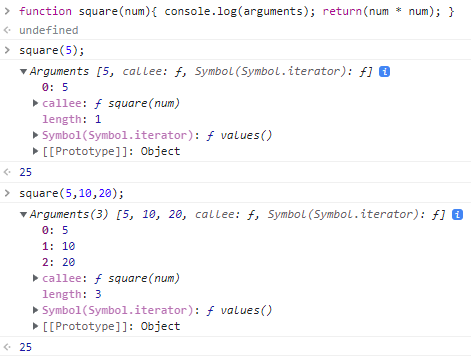

## 18.1 일급 객체
---

다음과 같은 조건을 만족하는 객체를 **일급 객체**라고 한다.

> 1. 무명의 리터럴로 생성할 수 있다. ( 런타임에 생성 가능 )
> 2. 변수나 자료구조에 저장할 수 있다.
> 3. 함수의 매개변수에 전달할 수 있다.
> 4. 함수의 반환값을 사용할 수 있다.

<br>

Javascript에선 함수는 일급 객체로 취급하므로 위의 조건들을 모두 만족한다.

```javascript
// 1. 함수는 무명의 리터럴로 생성할 수 있다.
// 2. 함수는 변수에 저장할 수 있다.
// 런타임(할당 단계)에 함수 리터럴이 평가되어 함수 객체가 생성되고 변수에 할당된다.
const increase = function (num) {
  return ++num;
};

const decrease = function (num) {
  return --num;
};

// 2. 함수는 객체에 저장할 수 있다.
const auxs = { increase, decrease };

// 3. 함수의 매개변수에게 전달할 수 있다.
// 4. 함수의 반환값으로 사용할 수 있다.
function makeCounter(aux) {
  let num = 0;

  return function () {
    num = aux(num);
    return num;
  };
}

// 3. 함수는 매개변수에게 함수를 전달할 수 있다.
const increaser = makeCounter(auxs.increase);
console.log(increaser()); // 1
console.log(increaser()); // 2

// 3. 함수는 매개변수에게 함수를 전달할 수 있다.
const decreaser = makeCounter(auxs.decrease);
console.log(decreaser()); // -1
console.log(decreaser()); // -2
```

> 함수를 일반 객체처럼 사용 가능. + 호출 가능

## 18.2 함수 객체의 프로퍼티
---
함수는 객체이므로 일반 객체와 똑같이 프로퍼티를 가질 수 있다.

```javascript
function square(number) {
  return number * number;
}

console.log(Object.getOwnPropertyDescriptors(square));
/*
{
  length: {value: 1, writable: false, enumerable: false, configurable: true},
  name: {value: "square", writable: false, enumerable: false, configurable: true},
  arguments: {value: null, writable: false, enumerable: false, configurable: false},
  caller: {value: null, writable: false, enumerable: false, configurable: false},
  prototype: {value: {...}, writable: true, enumerable: false, configurable: false}
}
*/

// __proto__는 square 함수의 프로퍼티가 아니다.
console.log(Object.getOwnPropertyDescriptor(square, '__proto__')); // undefined

// __proto__는 Object.prototype 객체의 접근자 프로퍼티다.
// square 함수는 Object.prototype 객체로부터 __proto__ 접근자 프로퍼티를 상속받는다.
console.log(Object.getOwnPropertyDescriptor(Object.prototype, '__proto__'));
// {get: ƒ, set: ƒ, enumerable: false, configurable: true}
```

arguments, caller , length, name, prototype 프로퍼티는 함수 객체의 고유 프로퍼티이다.<br>
함수도 일반 객체처럼 프로퍼티가 있지만 안의 구조가 다른 것을 확인할 수 있다.<br>

<br>

## 18.2.1 arguments 프로퍼티
---
arguments 프로퍼티는 함수 호출 시 전달된 인수들의 정보를 담고 있다. <br>
함수 내부에서 지역 변수처럼 사용된다. 즉, 함수 외부에서는 참조할 수 없다.<br>

<br>

또한 Javascript는 함수의 매개변수와 인수의 개수가 일치하는지 확인하지 않는다. <br>

```javascript
function multiply(x, y) {
  console.log(arguments);
  return x * y;
}

console.log(multiply());        // NaN
console.log(multiply(1));       // NaN
console.log(multiply(1, 2));    // 2
console.log(multiply(1, 2, 3)); // 2
```

함수가 선언이 되면 선언한 매개변수는 undefined로 초기화가 된다. <br>
이후호출이 될 때 인수가 해당 매개변수에 할당이 된다. <br>
이때, 할당된 인수가 매개변수의 수보다 적으면 맨 처음 초기화 상태인 undefined로 사용되어진다. <br>
초과된 인수는 arguments 객체의 프로퍼티로 남아있다. <br>

<br>



* 인수를 프로퍼티 값으로 소유하며, 키는 인수의 순서를 나타낸다.
* length는 인수의 개수를 나타낸다.
* callee 프로퍼티는 arguments 객체를 생성한 함수, 즉 함수 자신을 가리킨다.

<br>

```javascript
function multiply(x, y) {
  // 이터레이터
  const iterator = arguments[Symbol.iterator]();

  // 이터레이터의 next 메서드를 호출하여 이터러블 객체 arguments를 순회
  console.log(iterator.next()); // {value: 1, done: false}
  console.log(iterator.next()); // {value: 2, done: false}
  console.log(iterator.next()); // {value: 3, done: false}
  console.log(iterator.next()); // {value: undefined, done: true}

  return x * y;
}

multiply(1, 2, 3);
```

JS에서 arguments 객체는 유사 배열처럼 다룰 수 있다.
이때, Symbol.iterator 프로퍼티를 arguments 객체를 순회할 수 있다.

<br>
<br>

Javascript에선 전달되는 인수 개수에 따라 함수를 동작을 달리 정의할 수 있다. <br>
**arguments 객체는 매개변수 개수를 확정할 수 없는 가변 인자 함수를 구현할 때 유용하다.**

```javascript
function sum() {
  let res = 0;

  // arguments 객체는 length 프로퍼티가 있는 유사 배열 객체이므로 for 문으로 순회할 수 있다.
  for (let i = 0; i < arguments.length; i++) {
    res += arguments[i];
  }

  return res;
}

console.log(sum());        // 0
console.log(sum(1, 2));    // 3
console.log(sum(1, 2, 3)); // 6
```

<br>

**그러나 argument 객체를 통해 인자 수를 제어하는 것보단 Rest 파라미터를 이용하는 것이 권장되는 방법이다.**
```javascript
function sum(...args) {
    let res = 0;
    console.log(args);
    for (let i = 0; i < args.length; i++) {
        res += args[i];
    }
    return res;
}
```

<br>

함수의 arguments는 유사 배열 객체이지만 배열이 아니다.
따라서 배열 메서드를 사용할 경우 에러가 발생한다.
arguments에서 배열 메서드를 사용하긴 위해서 Function.prototype를 간접 호출해야 한다.

```javascript
function sum() {
  // arguments 객체를 배열로 변환
  const array = Array.prototype.slice.call(arguments);
  return array.reduce(function (pre, cur) {
    return pre + cur;
  }, 0);
}

console.log(sum(1, 2));          // 3
console.log(sum(1, 2, 3, 4, 5)); // 15
```

<br>

ES6에선 이런 번거러움을 해결하기 위해 Rest 파라미터를 도입했다.
```javascript
// ES6 Rest parameter
function sum(...args) {
  return args.reduce((pre, cur) => pre + cur, 0);
}

console.log(sum(1, 2));          // 3
console.log(sum(1, 2, 3, 4, 5)); // 15
```

<br>
<br>

## 18.2.2 caller 프로퍼티
---
함수 객체의 caller 프로퍼티는 함수 자신을 호출하는 함수를 가리킨다.
비표준 프로퍼티이므로 자세히 알 필요는 없다.

```javascript
function foo(func) {
  return func();
}

function bar() {
  return 'caller : ' + bar.caller;
}

// 브라우저에서의 실행한 결과
console.log(foo(bar)); // caller : function foo(func) {...}
console.log(bar());    // caller : null
```

<br>
<br>

## 18.2.3 length 프로퍼티
---
함수 객체의 length 프로퍼티는 함수를 정의할 때 선언한 매개변수의 개수를 가리킨다.
```javascript
function foo() {}
console.log(foo.length); // 0

function bar(x) {
  return x;
}
console.log(bar.length); // 1

function baz(x, y) {
  return x * y;
}
console.log(baz.length); // 2
```

> arguments 객체의 length 프로퍼티는 인수의 개수<br>
> 함수 객체의 length 프로퍼티는 매개변수의 개수<br>

<br>
<br>

## 18.2.4 name 프로퍼티
---
함수 객체의 name 프로퍼티는 함수의 이름을 나타낸다.<br>

>ES5에선 익명 함수 표현식일 경우는 빈 문자열을 값으로 갖는다.<br>
>ES6에선 함수 객체를가리키는 식별자를 값으로 갖는다.<br>

```javascript
// 기명 함수 표현식
var namedFunc = function foo() {};
console.log(namedFunc.name); // foo

// 익명 함수 표현식
var anonymousFunc = function() {};
// ES5: name 프로퍼티는 빈 문자열을 값으로 갖는다.
// ES6: name 프로퍼티는 함수 객체를 가리키는 변수 이름을 값으로 갖는다.
console.log(anonymousFunc.name); // anonymousFunc

// 함수 선언문(Function declaration)
function bar() {}
console.log(bar.name); // bar
```

<br>
<br>

## 18.2.5 __proto__ 접근자 프로퍼티
---
모든 객체는 [[Prototype]] 이라는 내부 슬롯을 갖는다.<br>
이때 해당 내부 슬롯에 직접 접근할 수 없어 __proto__ 프로퍼티를 통해 간접적으로 접근할 수 있다.<br>

```javascript
const obj = { a: 1 };

// 객체 리터럴 방식으로 생성한 객체의 프로토타입 객체는 Object.prototype이다.
console.log(obj.__proto__ === Object.prototype); // true

```

<br>
<br>

## 18.2.6 prototype 프로퍼티
---
prototype 프로퍼티는 생성자 함수를 호출할 수 있는 함수 객체만 가지고 있다.<br>
즉, 생성자 함수를 호출할 수 없는 non-constructor에는 해당 프로퍼티가 없다.<br>

```javascript
// 함수 객체는 prototype 프로퍼티를 소유한다.
(function () {}).hasOwnProperty('prototype'); // -> true

// 일반 객체는 prototype 프로퍼티를 소유하지 않는다.
({}).hasOwnProperty('prototype'); // -> false
```
