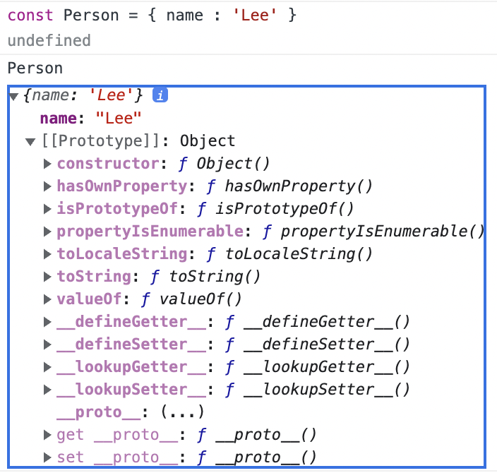

많은 사람들이 자바스크립트는 public, private, protected와 같은 캡슐화 키워드가 없어서 객체지향 언어가 아니라고 생각한다. <br>
하지만 자바스크립트는 클래스 기반 객체지향 프로그래밍 언어보다 효율적이며 더 강력한 객체지향 프로그래밍 능력을 지닌 프로토타입 기반의 객체지향 프로그래밍 언어이다.

> 자바스크립트는 객체 기반의 언어이며 거의 모든 데이터들이 "객체"로 이루어져 있다.

<br>
<br>

## 19.1 객체지향 프로그래밍
---

객체지향 프로그래밍은 여러 개의 독립적 단위, 즉 객체 집합으로 프로그램을 표현하는 패러다임을 말한다.<br>

예를 들어, 사람은 이름, 주소, 성별, 나이 , 신장 ... 등과 같은 다양한 속성을 갖는다.<br>
그 중에서 관심있는 속성만 추려서 객체를 표현하는 것을 **추상화**라고 한다.<br>

```javascript
// 이름과 주소 속성을 갖는 객체
const person = {
  name: 'Lee',
  address: 'Seoul'
};

console.log(person); // {name: "Lee", address: "Seoul"}
```

<br>
이처럼 객체지향 프로그래밍은 객체를 상태 데이터와 동작을 하나의 논리적인 단위로 묶어 표현한다.

<br>
<br>

## 19.2 상속과 프로토타입
---

**상속**은 객체지향 프로그래밍의 핵심 개념으로 특정 객체의 정보를 상속받아 그대로 사용할 수 있는 것을 말한다.

<br>
코딩을 할 때 불필요한 중복을 제거하는 게 매우 중요하다.<br>
중복을 제거하는 효과적인 방법은 상속과 같은 방법을 이용해 기존의 코드를 적극적으로 활용하는 것이다.<br>

```javascript
const circle = {
  radius: 5, // 반지름

  // 원의 지름: 2r
  getDiameter() {
    return 2 * this.radius;
  },

  // 원의 둘레: 2πr
  getPerimeter() {
    return 2 * Math.PI * this.radius;
  },

  // 원의 넓이: πrr
  getArea() {
    return Math.PI * this.radius ** 2;
  }
};

console.log(circle);
// {radius: 5, getDiameter: ƒ, getPerimeter: ƒ, getArea: ƒ}

console.log(circle.getDiameter());  // 10
console.log(circle.getPerimeter()); // 31.41592653589793
console.log(circle.getArea());      // 78.53981633974483
```

<br>

위의 코드에서 Circle의 모든 인스턴스는 radius 프로퍼티와 getArea 메서드를 갖는다. <br>
이때, getArea 메서드는 모든 인스턴스마다 동일한 함수이므로 단 하나만 생성해서 인스턴스가 이를 공유해서 사용하는 것이 바람직하다. <br>
하지만 위와 같은 방법으로 생성자 함수를 정의하면 매번 getArea 메서드를 중복 생성하여 비효율적으로 동작한다.<br>

<br>

위와 같은 문제를 상속을 통해 불필요한 중복을 제거해보자.

**자바스크립트는 프로토타입을 기반으로 상속을 구현한다.**

```javascript
// 생성자 함수
function Circle(radius) {
  this.radius = radius;
  this.getArea = function () {
    // Math.PI는 원주율을 나타내는 상수다.
    return Math.PI * this.radius ** 2;
  };
}

// 반지름이 1인 인스턴스 생성
const circle1 = new Circle(1);
// 반지름이 2인 인스턴스 생성
const circle2 = new Circle(2);

// Circle 생성자 함수는 인스턴스를 생성할 때마다 동일한 동작을 하는
// getArea 메서드를 중복 생성하고 모든 인스턴스가 중복 소유한다.
// getArea 메서드는 하나만 생성하여 모든 인스턴스가 공유해서 사용하는 것이 바람직하다.
console.log(circle1.getArea === circle2.getArea); // false

console.log(circle1.getArea()); // 3.141592653589793
console.log(circle2.getArea()); // 12.566370614359172
```

getArea 메서드는 단 하나만 생성되어 Circle.prototype의 메서드로 할당이 된다.<br>
자바스크립트에서 모든 인스턴스는 상위 객체역할을 하는 생성자 함수의 프로토타입의 모든 프로퍼티와 메서드를 상속받는다.<br>

<br>
<br>

## 19.3 프로토타입 객체
---

> 모든 객체는 하나의 프로토타입을 갖는다. 그리고 모든 프로토타입은 생성자 함수와 연결되어 있다.

<br>

[[Prototype]] 내부 슬롯에는 직접 접근할 수 없다.<br>
하지만 __proto__ 접근자 프로퍼티를 통해 자신의 [[Prototype]]이 가리키는 프로토타입에 간접적으로 접근이 가능하다.<br>
생성자 함수는 자신의 prototype 프로퍼티를 통해 접근이 가능하다.<br>

<br>
<br>

## 19.3.1 __proto__ 접근자 프로퍼티
---

**모든 객체는 __proto__를 통해 [[Prototype]] 내부 슬롯에 간접적 접근이 가능하다.



위와 같이 Person 객체의 [[Prototype]]에 간접적으로 접근하면 [[Prototype]] 내부 슬롯이 참조하고 있는 Object.property를 볼 수 있다.

<br>
<br>

__proto__는 객체가 직접 소유하는 프로퍼티가 아니라 상위 객체의 Object.prototype의 프로퍼티이다.
```javascript
const person = { name: 'Lee' };

// person 객체는 __proto__ 프로퍼티를 소유하지 않는다.
console.log(person.hasOwnProperty('__proto__')); // false

// __proto__ 프로퍼티는 모든 객체의 프로토타입 객체인 Object.prototype의 접근자 프로퍼티다.
console.log(Object.getOwnPropertyDescriptor(Object.prototype, '__proto__'));
// {get: ƒ, set: ƒ, enumerable: false, configurable: true}

// 모든 객체는 Object.prototype의 접근자 프로퍼티 __proto__를 상속받아 사용할 수 있다.
console.log({}.__proto__ === Object.prototype); // true
```

<br>

프로토타입은 체인 형태로 상위 프로토타입 프로퍼티로 연결이 된다.<br>
즉, 양방향으로 연결되어 서로가 서로의 프로토타입을 참조하는 무한 루프에 빠지느 경우가 생기지 않는다.<br>

> __proto__ 접근자 프로퍼티를 실제 개발에서 사용되는 것을 권장하지 않는다.<br>

<br>
<br>

## 19.3.2 함수 객체의 prototype 프로퍼티
---
함수 객체만이 소유하는 prototype 프로퍼티는 생성자 함수가 생성할 인스턴스의 프로토타입을 가리킨다.

```javascript
// 함수 객체는 prototype 프로퍼티를 소유한다.
(function () {}).hasOwnProperty('prototype'); // -> true

// 일반 객체는 prototype 프로퍼티를 소유하지 않는다.
({}).hasOwnProperty('prototype'); // -> false
```

<br>
<br>

함수 객체에서 prototype은 인스턴스의 프로토타입을 가리키므로 생성자 함수로 호출할 수 없는 ES6의 화살표 함수와 메서드 축약 표현 함수는 prototype 프로퍼티를 소유하지 않는다. 

```javascript
// 화살표 함수는 non-constructor다.
const Person = name => {
  this.name = name;
};

// non-constructor는 prototype 프로퍼티를 소유하지 않는다.
console.log(Person.hasOwnProperty('prototype')); // false

// non-constructor는 프로토타입을 생성하지 않는다.
console.log(Person.prototype); // undefined

// ES6의 메서드 축약 표현으로 정의한 메서드는 non-constructor다.
const obj = {
  foo() {}
};

// non-constructor는 prototype 프로퍼티를 소유하지 않는다.
console.log(obj.foo.hasOwnProperty('prototype')); // false

// non-constructor는 프로토타입을 생성하지 않는다.
console.log(obj.foo.prototype); // undefined
```

<br>
<br>

## 19.3.3 프로토타입의 constructor 프로퍼티와 생성자 함수
---
모든 프로토타입은 constructor 프로퍼티를 갖는다.<br>
이 프로퍼티는  자신을 참조하고 있는 생성자 함수를 가리킨다.<br>
이 연결은 새로운 객체가 생성될 때 사용이 되어진다.

```javascript
// 생성자 함수
function Person(name) {
  this.name = name;
}

const me = new Person('Lee');

// me 객체의 생성자 함수는 Person이다.
console.log(me.constructor === Person);  // true
```

<br>
<br>

## 19.4 리터럴 표기법에 의해 생성된 객체의 생성자 함수와 프로토타입
---

리터럴 표기법에 의한 객체 생성 방식에는 명시적으로 생성자 함수를 호출하지 않는다.<br>
하지만 리터럴 표기법으로 생성된 객체에도 프로토타입이 물론 존재한다. <br>
하지만 해당 경우에는 프로토타입의 constructor가 반드시 객체를 생성한 생성자 함수라고 단정할 수 없다.<br>

```javascript
// obj 객체는 Object 생성자 함수로 생성한 객체가 아니라 객체 리터럴로 생성했다.
const obj = {};

// 하지만 obj 객체의 생성자 함수는 Object 생성자 함수다.
console.log(obj.constructor === Object); // true
```

> 프로토타입과 생성자 함수는 단독적으로 존재할 수 없고 항상 쌍으로 존재한다.

리터럴 표기법으로 생성된 객체는 생성자 함수에 의해 생성된 객체가 아니다.<br>
하지만 큰 틀에서 보면, 둘 다 같은 본질적인 면에서는 동일하다고 볼 수 있다.<br>

## 19.5 프로토타입의 생성 시점
---

위에서도 봤듯이 리터럴 표기법에 의해 생성된 객체도 생성자 함수와 연결되어 있다.<br>
JS에서 모든 객체느 생성자 함수와 연결되어 있다.<br>

<br>

**프로토타입은 생성자 함수가 생성되는 시점에 더불어 생성된다.**

<br>
<br>

## 19.5.1 사용자 정의 생성자 함수와 프로토타입 생성 시점

함수 정의가 평가되어 함수 객체를 생성하는 시점에 프로토타입도 더불어 생성된다.<br>

```javascript
// 함수 정의(constructor)가 평가되어 함수 객체를 생성하는 시점에 프로토타입도 더불어 생성된다.
console.log(Person.prototype); // {constructor: ƒ}

// 생성자 함수
function Person(name) {
  this.name = name;
}
```

<br>
위에서 말했듯이 생성자 함수를 호출할 수 없는 non-constructor는 프로토타입이 생성되지 않는다.

```javascript
// 화살표 함수는 non-constructor다.
const Person = name => {
  this.name = name;
};

// non-constructor는 프로토타입이 생성되지 않는다.
console.log(Person.prototype); // undefined
```

<br>
<br>

## 19.5.2 빌트인 생성자 함수와 프로토타입 생성 시점
---

Object, String, Number, Function 등과 같은 빌트인 생성자 함수도 마찬가지로 생성자 함수가 생성되는 시점에 프로토타입이 생성된다.<br>
모든 빌트인 생성자 함수는 전역 객체가 생성되는 시점에 생성이 되고 그 시점에 같이 프로토타입이 생성된다.

<br>
<br>

## 19.6 객체 생성 방식과 프로토타입의 결정
---

객체를 생성하는 방법은 다음과 같다.

- 객체 리터럴
- Object 생성 함수
- 생성자 함수
- Object.create 메서드
- 클래스(ES6)

<br>

각 방식마다 세부적인 차이는 있겠지만 공통적으로 OrdinaryObjectCreate라는 추상 연산에 의해 생성된다.<br>
OrdinaryObjectCreate는 필수적으로 생성할 객체의 프로토타입을 인수로 전달받는다.<br>
즉, 이 시점에 어떤 인수가 전달되는지에 따라 프로토타입이 결정된다.<br>

<br>
<br>

## 19.6.1 객체 리터럴에 의해 생성된 객체의 프로토타입
---

> 객체 리터럴에 의해 생성되는 객체의 프로토타입은 Object.prototype이다.
```javascript
const obj = { x: 1 };

// 객체 리터럴에 의해 생성된 obj 객체는 Object.prototype을 상속받는다.
console.log(obj.constructor === Object); // true
console.log(obj.hasOwnProperty('x'));    // true
```

<br>
<br>

## 19.6.2 Object 생성자 함수에 의해 생성된 객체의 프로토타입
---

Object 생성자 함수를 인수 없이 호출하면 빈 객체가 생성된다.<br>
해당 방법으로 객체를 생성하면 마찬가지로 OrdinaryObjectCreate가 호출된다.<br>

즉, 객체 리터럴 방식과 동일한 방식으로 prototype과 연결된다는 것을 알 수 있다.

```javascript
const obj = new Object();
obj.x = 1;

// Object 생성자 함수에 의해 생성된 obj 객체는 Object.prototype을 상속받는다.
console.log(obj.constructor === Object); // true
console.log(obj.hasOwnProperty('x'));    // true
```

<br>
두 방식의 차이는 프로퍼티 추가하는 부분에 차이점이 있다.<br>
객체 리터럴은 내부에 프로퍼티를 추가하지만 Object 생성자 함수 방식은 일단 빈 객체를 생성한 이후에 프로퍼티를 추가한다.<br>

<br>
<br>

## 19.7 프로토타입 체인
---

```javascript
function Person(name) {
  this.name = name;
}

// 프로토타입 메서드
Person.prototype.sayHello = function () {
  console.log(`Hi! My name is ${this.name}`);
};

const me = new Person('Lee');

// hasOwnProperty는 Object.prototype의 메서드다.
console.log(me.hasOwnProperty('name')); // true
```

위의 코드를 살펴보면, Person 생성자 함수에 의해 생성된 객체 me 객체는 Person.prototype 뿐만 아니라 Object.prototype을 상속받았음을 확인할 수 있다.

<br>

> 즉, 객체를 생성할 때 생성자 함수의 프로토타입과 동시에 상위 객체의 프로토타입을 상속받는다는 것이다.

JS는 객체의 특정 프로퍼티에 접근할 때 해당 프로퍼티가 없다면 [[Prototype]] 참조를 따라 부모 객체의 프로토타입 프로퍼티를 탐색한다.<br>

**이러한 방식이 JS에서 프로토타입으로 구현한 상속 개념이다.**

<br>
<br>

> 모든 객체는 Object.prototype을 상속받는다.

즉, 프로토타입 체인의 종점은 항상 Object.prototype이 있음을 알 수 있다.


<br>
<br>

## 19.8 오버라이딩과 프로퍼티 섀도잉
---

```javascript
const Person = (function () {
  // 생성자 함수
  function Person(name) {
    this.name = name;
  }

  // 프로토타입 메서드
  Person.prototype.sayHello = function () {
    console.log(`Hi! My name is ${this.name}`);
  };

  // 생성자 함수를 반환
  return Person;
}());

const me = new Person('Lee');

// 인스턴스 메서드
me.sayHello = function () {
  console.log(`Hey! My name is ${this.name}`);
};

// 인스턴스 메서드가 호출된다. 프로토타입 메서드는 인스턴스 메서드에 의해 가려진다.
me.sayHello(); // Hey! My name is Lee
```

위와 같이 프로토타입의 프로퍼티와 동일한 이름의 프로퍼티를 인스턴스에 할당할 수 있다.<br>
이런 경우 프로토타입의 프로퍼티가 변경되는 것이 아닌 인스턴스에 해당 새로운 프로퍼티가 생긴다.<br>
이를 **오버라이딩**이라고 부른다.<br>

**오버라이딩(overriding)**
> 상위 클래스가 가지고 있는 메서드를 하위 클래스에서 재정의

<br>

**오버로딩(overloading)**
> 함수의 이름은 동일하지만 매개변수를 다르게 해서 정의

<br>
<br>

## 19.9 프로토타입의 교체
---

프로토타입을 임의의 다른 객체로 변경할 수 있다.<br>
즉, 동적으로 부모 객체인 프로토타입을 변경할 수 있다는 것이다.<br>

<br>

constructor 프로퍼티를 추가하여 프로토타입의 constructor를 재설정 할 수 있다.

```javascript
const Person = (function () {
  function Person(name) {
    this.name = name;
  }

  // 생성자 함수의 prototype 프로퍼티를 통해 프로토타입을 교체
  Person.prototype = {
    // constructor 프로퍼티와 생성자 함수 간의 연결을 설정
    constructor: Person,
    sayHello() {
      console.log(`Hi! My name is ${this.name}`);
    }
  };

  return Person;
}());

const me = new Person('Lee');

// constructor 프로퍼티가 생성자 함수를 가리킨다.
console.log(me.constructor === Person); // true
console.log(me.constructor === Object); // false
```

<br>
<br>

## 19.10 instanceof 연산자
---

instanceof 연산자는 이항 연산자로서 좌변에는 객체 식별자, 우변에는 생성자 함수를 가리키는 식별자를 피연산자로 받는다.<br>

> [객체] instanceof [생성자 함수]

<br>

해당 연산자는 우변 생성자 함수의 prototype에 바인딩된 객체가 좌변 객체의 프로토타입 체인 상에 존재하면 true, 아니면 false를 반환한다.

<br>

```javascript
// 생성자 함수
function Person(name) {
  this.name = name;
}

const me = new Person('Lee');

// Person.prototype이 me 객체의 프로토타입 체인 상에 존재하므로 true로 평가된다.
console.log(me instanceof Person); // true

// Object.prototype이 me 객체의 프로토타입 체인 상에 존재하므로 true로 평가된다.
console.log(me instanceof Object); // true
```

<br>
<br>

## 19.11 직접 상속
---

```javascript
// 프로토타입이 null인 객체를 생성한다. 생성된 객체는 프로토타입 체인의 종점에 위치한다.
// obj → null
let obj = Object.create(null);
console.log(Object.getPrototypeOf(obj) === null); // true
// Object.prototype을 상속받지 못한다.
console.log(obj.toString()); // TypeError: obj.toString is not a function

// obj → Object.prototype → null
// obj = {};와 동일하다.
obj = Object.create(Object.prototype);
console.log(Object.getPrototypeOf(obj) === Object.prototype); // true

// obj → Object.prototype → null
// obj = { x: 1 };와 동일하다.
obj = Object.create(Object.prototype, {
  x: { value: 1, writable: true, enumerable: true, configurable: true }
});
// 위 코드는 다음과 동일하다.
// obj = Object.create(Object.prototype);
// obj.x = 1;
console.log(obj.x); // 1
console.log(Object.getPrototypeOf(obj) === Object.prototype); // true

const myProto = { x: 10 };
// 임의의 객체를 직접 상속받는다.
// obj → myProto → Object.prototype → null
obj = Object.create(myProto);
console.log(obj.x); // 10
console.log(Object.getPrototypeOf(obj) === myProto); // true

// 생성자 함수
function Person(name) {
  this.name = name;
}

// obj → Person.prototype → Object.prototype → null
// obj = new Person('Lee')와 동일하다.
obj = Object.create(Person.prototype);
obj.name = 'Lee';
console.log(obj.name); // Lee
console.log(Object.getPrototypeOf(obj) === Person.prototype); // true
```

Object.create 메서드는 첫 번째 매겨변수에 전달한 객체의 프로토타입 체인에 속하는 객체를 생성한다.<br>
즉, 직접적으로 상속을 구현하는 것이다.<br>

<br>

해당 방법은 다음의 장점이 있다.

> * new 연산자 없이도 객체를 생성할 수 있다.
> * 프로토타입을 지정하면서 객체를 생성할 수 있다.
> * 객체 리터럴에 의해 생성된 객체도 상속받을 수 있다.

<br>
<br>

## 19.11.2 객체 리터럴 내부에서 __proto__에 의한 직접 상속
---

ES6에서 객체 리터럴 내부에서 __proto__ 접근자 프로퍼티를 사용하여 직접 상속을 구현할 수 있다.

```javascript
const myProto = { x: 10 };

// 객체 리터럴에 의해 객체를 생성하면서 프로토타입을 지정하여 직접 상속받을 수 있다.
const obj = {
  y: 20,
  // 객체를 직접 상속받는다.
  // obj → myProto → Object.prototype → null
  __proto__: myProto
};
/* 위 코드는 아래와 동일하다.
const obj = Object.create(myProto, {
  y: { value: 20, writable: true, enumerable: true, configurable: true }
});
*/

console.log(obj.x, obj.y); // 10 20
console.log(Object.getPrototypeOf(obj) === myProto); // true
```

<br>
<br>

## 19.12 정적 프로퍼티/메서드
---

정적 프로퍼티/메서드는 생성자 함수로 인스턴스를 생성하지 않아도 참조/호출할 수 있는 프로퍼티/메서드를 의미한다.

```javascript
// 생성자 함수
function Person(name) {
  this.name = name;
}

// 프로토타입 메서드
Person.prototype.sayHello = function () {
  console.log(`Hi! My name is ${this.name}`);
};

// 정적 프로퍼티
Person.staticProp = 'static prop';

// 정적 메서드
Person.staticMethod = function () {
  console.log('staticMethod');
};

const me = new Person('Lee');

// 생성자 함수에 추가한 정적 프로퍼티/메서드는 생성자 함수로 참조/호출한다.
Person.staticMethod(); // staticMethod

// 정적 프로퍼티/메서드는 생성자 함수가 생성한 인스턴스로 참조/호출할 수 없다.
// 인스턴스로 참조/호출할 수 있는 프로퍼티/메서드는 프로토타입 체인 상에 존재해야 한다.
me.staticMethod(); // TypeError: me.staticMethod is not a function
```

<br>
위의 코드처럼 Person 생성자 함수 객체가 소유한 프로퍼티/메서드는 인스턴스 없이 바로 호출이 가능하다.

<br>

해당 프로퍼티/메서드는 인스턴스 프로토타입 체인 상에 존재하지 않으므로 인스턴스에서 이를 호출할 수는 없다.

```javascript
function Foo() {}

// 프로토타입 메서드
// this를 참조하지 않는 프로토타입 메소드는 정적 메서드로 변경해도 동일한 효과를 얻을 수 있다.
Foo.prototype.x = function () {
  console.log('x');
};

const foo = new Foo();
// 프로토타입 메서드를 호출하려면 인스턴스를 생성해야 한다.
foo.x(); // x

// 정적 메서드
Foo.x = function () {
  console.log('x');
};

// 정적 메서드는 인스턴스를 생성하지 않아도 호출할 수 있다.
Foo.x(); // x
```

<br>
<br>

## 19.13 프로퍼티 존재 확인
---

> in 연산자

in 연산자는 객체 내의 특정 프로퍼티가 존재하는지 확인하다.

```javascript
const person = {
  name: 'Lee',
  address: 'Seoul'
};

// person 객체에 name 프로퍼티가 존재한다.
console.log('name' in person);    // true
// person 객체에 address 프로퍼티가 존재한다.
console.log('address' in person); // true
// person 객체에 age 프로퍼티가 존재하지 않는다.
console.log('age' in person);     // false
```

in 연산자는 해당 객체 프로퍼티 뿐만 아니라 상속받은 모든 프로토타입의 프로퍼티를 확인하므로 주의해야 한다.

<br>

> in 연산자 대신 ES6에 도입된 Reflect.has 메서드를 사용할 수 있다. 동작은 동일하다.

<br>
<br>

## 19.14 프로퍼티 열거
---

> for...in 문 : 객체의 모든 프로퍼티를 순회하며 열거한다.

```javascript
  for ( 변수 선언문 in 객체 ) { ... }
```


<br>

```javascript
const person = {
  name: 'Lee',
  address: 'Seoul'
};

// for...in 문의 변수 prop에 person 객체의 프로퍼티 키가 할당된다.
for (const key in person) {
  console.log(key + ': ' + person[key]);
}
// name: Lee
// address: Seoul
```

<span style="color:red"><주의> for...in문 in문과 동일하게 해당 객체 프로퍼티 뿐만 아니라 상속받은 모든 프로퍼티 중 [[Enumerable]] 값이 true인 열거 가능한 프로퍼티도 순회한다. </span>

<br>
<br>

## 19.14.2 Object.keys/values/entries 메서드
---

위에서 말했듯이 for..in문은 상속받은 프로퍼티도 열거하므로 의도치 않은 동작을 할 수 있다.<br>
따라서 객체 고유의 프로퍼티만 열거하기 위해서 Object.keys/values/entries 메서드를 사용해야 한다.<br>

<br>

**Object.keys**

```javascript
const person = {
  name: 'Lee',
  address: 'Seoul',
  __proto__: { age: 20 }
};

console.log(Object.keys(person)); // ["name", "address"]
```

<br>
<br>

**Object.values**
```javascript
console.log(Object.values(person)); // ["Lee", "Seoul"]
```

<br>
<br>

**Object.entries**
```javascript
console.log(Object.entries(person)); // [["name", "Lee"], ["address", "Seoul"]]

Object.entries(person).forEach(([key, value]) => console.log(key, value));
/*
name Lee
address Seoul
*/
```